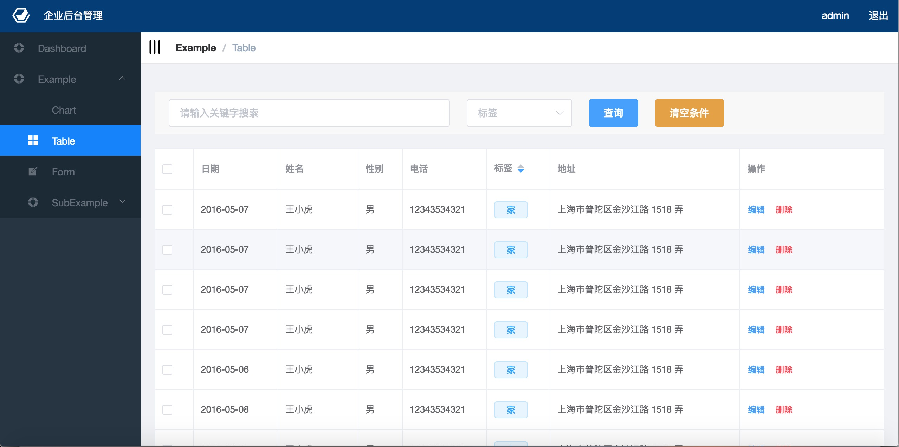
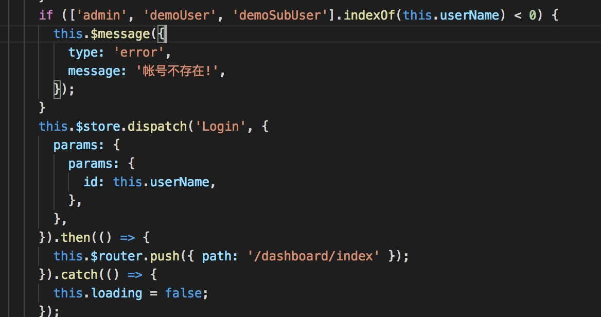
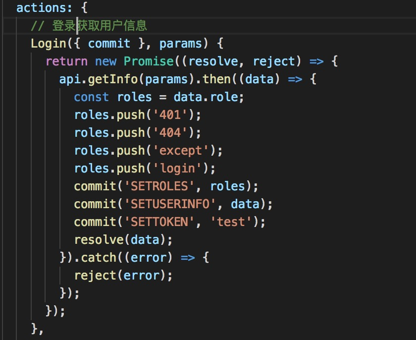
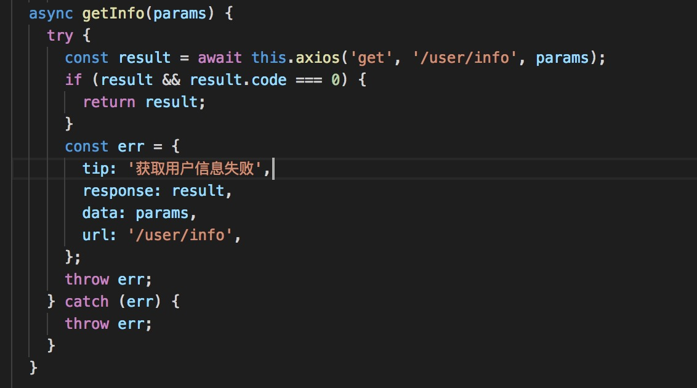
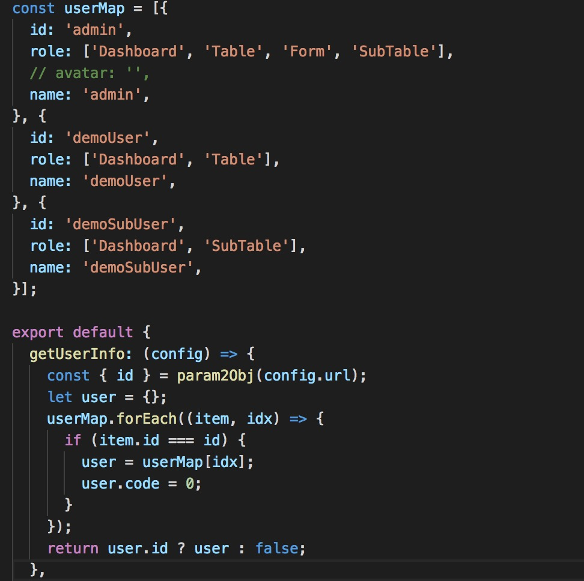
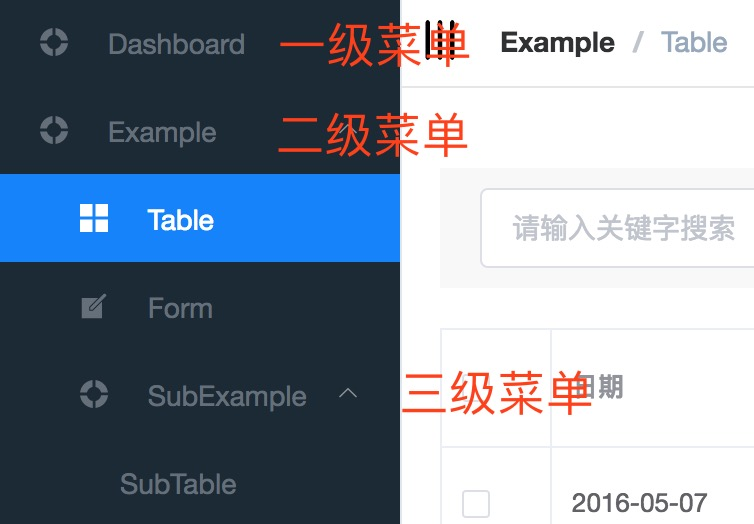
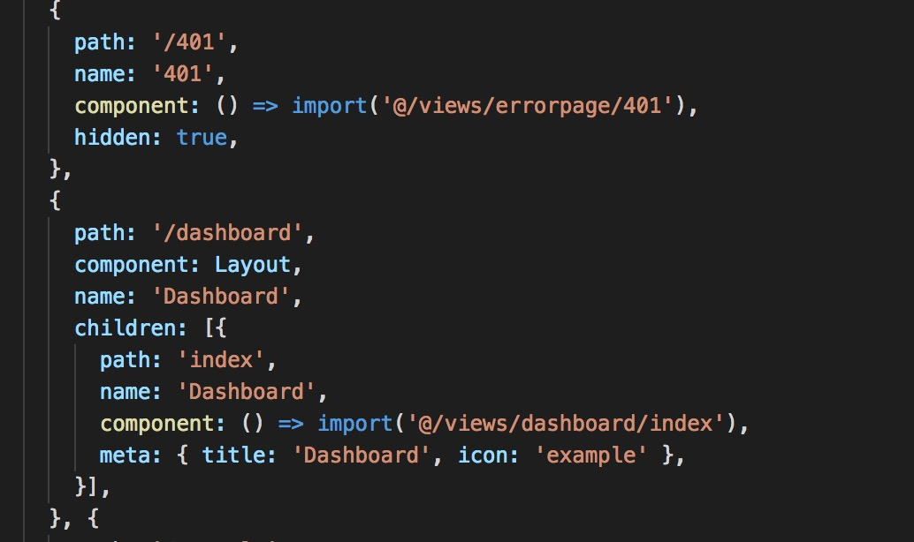
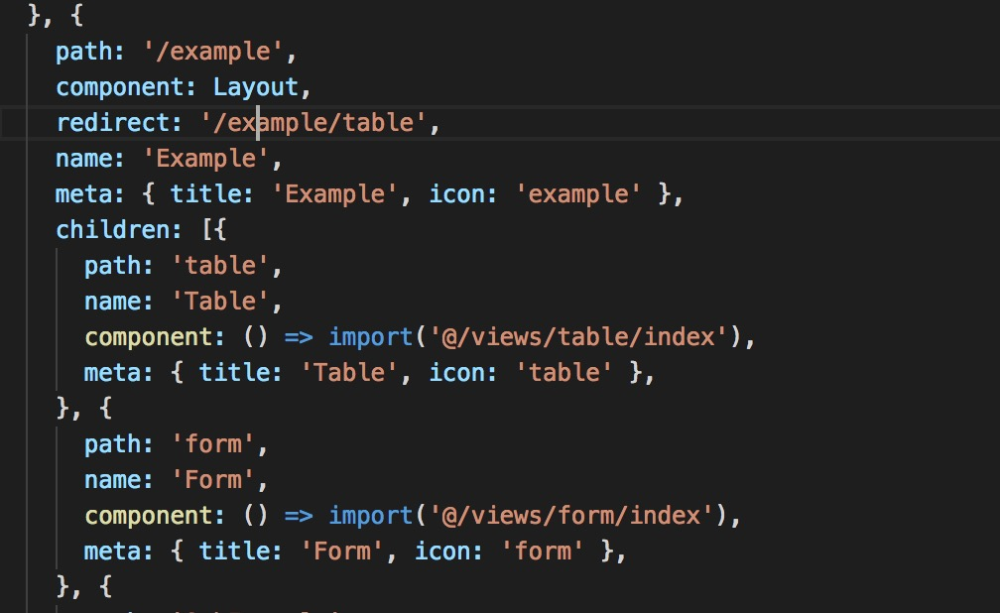
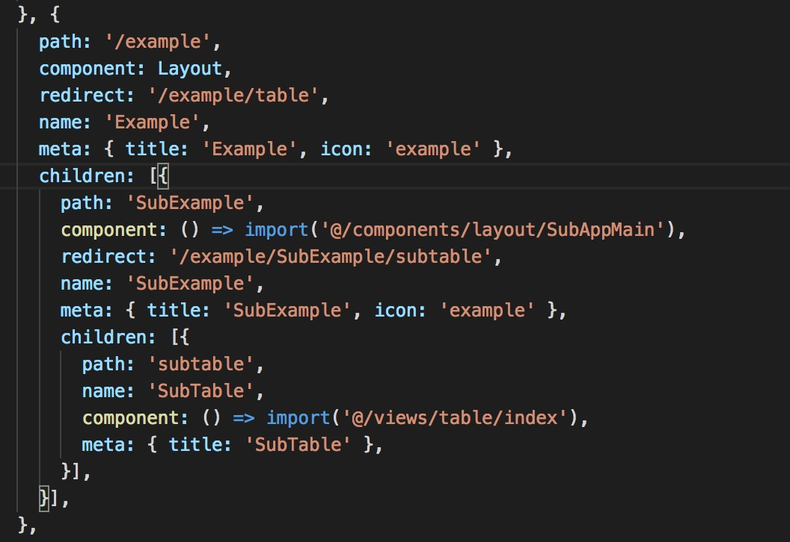
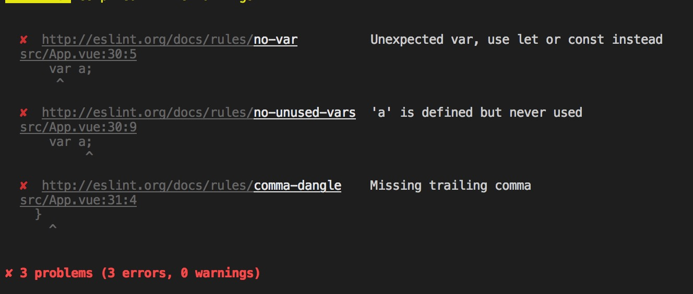

# 同vue-eim-pc-template-v2

## 简介

**vue-eim-pc-template-v2**是继v1版本后的一个升级版的后台模板，基于`vue.js`和`element`。目前模板项目中集成了*登陆*，*权限验证*，*路由配置*，*ajax请求*，*mock*，*图表*，*404页面*，*401页面*以及若干个*模板页面*。解决服务端人员开发后台管理页面的痛处。接下来会好好介绍使用该项目之前要做的准备，以及如何使用该项目，望能帮助到一些前端基础较为薄弱的伙伴~

**注意**：本项目中使用element-ui@2.3.0+版本，以及vue@2.5.0+

## 前序

### 环境

ß本地要安装[node](https://nodejs.org/en/)(8.0+)，可以直接下载安装版，按照步骤即可。安装完成后，验证是否安装成功。

```
node -v
npm -v
```

出现版本号即成功

### 技术栈

项目中主要有以下技术点：

- [es2015+](http://es6.ruanyifeng.com/)
- [vue](https://cn.vuejs.org/index.html)
- [vuex](https://vuex.vuejs.org/zh-cn/)
- [vue-router](https://router.vuejs.org/zh-cn/)
- [element-ui](http://element.eleme.io/#/)
- [echarts](http://echarts.baidu.com/)
- [mockjs](http://mockjs.com/)
- [eslint](http://eslint.cn/docs/user-guide/configuring)
- [axios](https://github.com/axios/axios)
- [babel-polyfill](https://babeljs.cn/docs/usage/polyfill/)

对服务端开发来说，以上只需要关注vue语法、element-ui组件库，axios请求写法，eslint代码规范，如果有用到图表，也要关注echarts。

**着重说明：**项目中强制使用了eslint，目的在于规范代码的书写，刚开始接触可能会觉得很恶心，要到官网中查明语法出了哪些问题，要怎么修改。但对于后期维护来说，是及其有价值的投入。故不要觉得烦琐，习惯了就好^-^

### 代码结构

```
// 结构树
|- build/  ------------------- 组件webpack区
|- config/  ------------------ 组件启动配置区，开发人员可在index.js中配置动态代理（当运行npm run dev时，该动态代理会生效，即可调用服务端接口），也可以修改端口号，防止端口号冲突
|- src/  --------------------- 组件源代码
	|- api/  ----------------- 接口编码区
	|- assets/  -------------- 图片区
    |- components/  ---------- 组件编码区
    |- icons/  --------------- 菜单icon svg图标区
    |- mock/  ---------------- 模拟接口区
    |- permission/  ---------- 路由权限编码区(可以不用修改)
    |- router/ --------------- 配置路由区，开发完成的页面都要在这里挂路由，才能展现
    |- store/  --------------- 全局缓存注入区，目前登陆的入口从这进入，会缓存用户信息，token信息以及权限信息
    |- styles/  -------------- 公共样式区
    |- utils/ ---------------- 工具区，开发人员开发的工具集都放在该目录中
    |- views/ ---------------- 页面开发区，开发人员开发的页面放在该目录中
    |- App.vue --------------- 启动的vue文件
    |- index.js -------------- 启动js文件，element-ui是按需加载的，开发人员要根据引用了哪些element组件在该js文件中引入，引入格式参照模板
|- static/  ------------------ static放置一些静态文件，和assets的区别：assets会被编译替换名字，static中的不会被编译，原汁原味
|- .babelrc  ----------------- babel 配置文件
|- .eslintignore  ------------ eslint ignore配置文件
|- .eslintrc.js  ------------- eslint配置文件
|- .gitignore  --------------- git忽略提交文件配置
|- .postcssrc.js  ------------ postcss配置文件
|- index.html  --------------- HTML 模板
|- package-lock.json  -------- npm 版本锁定文件，每添加一个依赖都会变化这个，保证对依赖版本的控制
|- package.json  ------------- npm 配置文件
|- README.md  ---------------- 项目帮助文档
```

> 实际开发人员开发页面最需要关注的目录是**/src/views**和**/src/router** 前者编写页面，后者编写对应页面的路由信息，***路由中的name在模板中用来充当权限判断字段***，即服务端返回的权限数组其实是和name做比较，匹配得到的才是用户拥有的权限页面，否则返回401页面或404页面。

### 项目展示




### 开发

```
步骤一：
将本项目克隆到本地
git clone XXX
步骤二：
安装依赖
npm install
步骤三：
开发及预览
npm run dev
步骤四：
当运行上步控制台报了很多错误时，先运行
npm run lint
会自动帮你解决一些格式化的错误，若还有错误，就得自己找到错误的关键字，到官网中查找该如何修复，后面会介绍步骤
```

#### 开发事项

##### element-ui组件引用

以button组件为例，当需要引入button组件时，需要有以下几个步骤

1. 当官网中找到对应的组件，拷贝对应的代码

   ```
   <el-button>默认按钮</el-button>
   ```

2. 按需引入该组件到/src/index.js中，若不清楚要怎么引入，可参照[全量组件的按需引入](https://github.com/ElemeFE/element/blob/dev/src/index.js)，找到对应的组件引入即可

3. 认真阅读该组件的使用方式，官网文档会介绍的很清楚

##### 用户登录接口修改

模板项目中的登录用的是mockjs模拟登录的，模板中的登录具体实现步骤是

1. 登录页，路径：/views/login/index.vue



> 注意：
>
> 1. if判断中的账号不存在需要修改，模板中总共有三个用户名，分别对应三个用户权限，为了写法简便，我是这么写的，实际应该是调接口后接口的返回提示。
> 2. this.$store.dispatch('Login', ...)是vuex的语法，目的是调用/src/store/modules/user.js中的Login方法去请求服务端接口，返回对应的用户数据存储在全局缓存中，便于全局调用。
> 3. 注意参数的格式，对象内参数固定为params，params的值又是一个对象，对象内可以放axios允许使用的各种参数，因为此处模拟的是get请求，所有只需要用到params参数就行，更多的参数见[axios config](https://github.com/axios/axios#request-config)

2. store全局缓存Login 路径：/src/store/modules/user.js

### 

> 当点击登录时，会调用以上的方法，方法体实际调用的是/scr/api/api.js中的getInfo接口，获取对应的用户数据，其中push的四个路由是无论哪个权限的人员都应该能访问的路由，先插入到路由数组中，接着缓存权限、用户信息和token信息。

3. getInfo接口 路径：/src/api/api.js



>接着调用getInfo接口，此处用到async（es6）,这里需要注意result.code，根据服务端接口设置的格式来设定，有可能是state，或status，或code，因人而异。

4. Mock模拟接口请求 路径：/src/mock/login.js



>注意userMap对象，是我模拟的三个用户，其中的role字段为权限字段，与路由配置表中的name字段做比较，权限字段中的菜单才是用户拥有权限的功能页。
>
>**实际开发中，修改登录接口时，role字段是必须要有，且格式要和上面的数组一致，否则权限系统会无效**

经过以上的四步，完成了登录的整个操作流程

##### 路由表配置规则

> 路径：/src/router/index.js
>
> 模板系统中的菜单和路由表是密不可分的，换句话说，**菜单的层级结构和路由表是一致的**。因此路由表必须要按照规则书写，否则会影响到菜单的展示！
>
> 先要明白设定的规则，**菜单不能超过三级**，因此路由配置表中的格式就存在三种格式，以下分别介绍



1. 一级菜单



>注意401这个路由参数hidden，当设置为true时，代表菜单树会过滤掉这个路由不展现
>
>Dashboard路由为一级菜单，一级菜单书写格式如上，children内有且只有一个路由
>
>meta中的参数title代表菜单上显示的菜单名
>
>icon为菜单图标，读取的是/src/icons/目录中的svg菜单图标，因此在做自己的项目时，要让美工出svg格式的菜单图标，然后放置在icons目录内，icon的参数值为icons的文件名
>
>一级菜单的权限匹配name为children内的name

2. 二级菜单



> 二级菜单和一级菜单的唯一区别在于children为大于一个，其他一样。

3. 三级菜单



> 三级菜单格式在children内有children

路由表的配置必须要根据以上的说明配置，否则要的效果会不是你想要的。另外注意name和菜单权限的配对，控制菜单展现。

##### 接口编写

> 路径：/src/api/api.js
>
> 页面中使用到的所有接口都必须定义到这个文件中，目的在于统一管理，方便修改
>
> 书写格式为模板提供的书写方式。
>
> 但是在实际开发中，会遇到多种传输参数的方式，如get，post非表单形式，post表单形式，rest形式。以下为这些格式都有对应的书写模板。

1. get请求
2. post表单提交
3. post非表单提交
4. rest形式

##### 接口代理

> 实际开发都是本机开发，用npm run dev本地启动服务，这样问题就来了，当要请求接口时，该如何处理？
>
> 其实很简单，就是一个配置而已
>
> 路径：/config/index.js

```
proxyTable: {
  '/cloudfs': {
    target: 'http://eim2.szcomtop.com:6888',
    changeOrigin: true,
    pathRewrite: {
  		'^/cloudfs': '/cloudfs'
	}
  },
  '/api': {
    target: 'http://eim2.szcomtop.com:6888',
    changeOrigin: true,
    pathRewrite: {
    	'^/api': '/api'
    }
  },
  '/uom': {
    target: 'http://eim2.szcomtop.com:6888',
    changeOrigin: true
  },
  '/plustek': {
    target: 'http://eim2.szcomtop.com:6888/plustek',
    changeOrigin: true,
    onProxyReq: function (proxyReq, req, res) {
      console.log('获取到', process.env.eimCookie)
      proxyReq.setHeader('Cookie', process.env.eimCookie) // 配置cookie方式
    },
    pathRewrite: {
    	'^/plustek': ''
    }
  }
},
session: {
  userName: 'admin',
  path: 'http://eim2.szcomtop.com:6888/plustek/pc/index.html' // eim2中对应项目的链接
}
```

开发人员可以根据需要自行配置代理

##### 设置cookie信息

> 若后台系统有自己的认证机制，如jwt。则可以不用考虑cookie信息认证。
>
> 若是用企信认证机制，就要设置cookie。开发环境的Cookie是模拟放置在header中处理的，因此设置cookie有两种方式，
>
> 1. 直接在上面的配置代理中，添加onProxyReq的配置，往header信息中塞进Cookie信息，保存重新npm run dev
> 2. 方式二用登录脚本，自动登录获取Cookie，拼接到header中。方式二较为复杂，接下来介绍下步骤。
>    - 修改/config/index.js中的session对象的path，该path可以写本项目的swagger-ui.html。脚本会先请求该url获取有效信息后，保存到nodejs的全局对象process.env.eimCookie中。userName和password为登录的账号和密码
>    - 启动后，会自动获取，不需要开发人员去替换cookie
>    - 若cookie过期，只要将浏览器的请求地址替换成http://your_ip_address/reset会自动续期。续期后回到原来的页面请求，就不会过期了。
>
> 方式一和方式二对比，第一种每次要自己修改替换，第二种只要修改配置中的path就可以。
>
> 但是不是所有的情况都支持第二种的，因为第二种情况是企信认证机制的脚本，若不走这个方式，也只能用第一种方式。

##### eslint代码规范修改步骤

> 当你写完代码后，兴致勃勃的认为已经完成了，于是想发布。结果发现，发布会被驳回，因为当代码中存在格式问题的话，是不允许提交到服务器上的。
>
> 那碰到代码格式问题要怎么解决呢？



1. 先用npm run lint。无论三七二十一，先执行这个，会很快的消除很多格式上的问题

2. 若发现还是有很多问题，那就必须一个一个解决。解决方式如下

   > 1. 错误提示中有一个链接，如http://eslint.ort/docs/rules/no-var 点击这个链接到eslint的官网，查明报错的原因，修改成对应的格式。
   > 2. 若这个错误确实不好修改，可以屏蔽这个规范。到根目录的.eslintrc.js文件中，rules对象中添加对应的规则屏蔽，如上面的no-var规则，配置"no-var": 0 这个规则就被过滤了。


####发布

```
npm run build
运行完这个步骤后，会在该目录下生成vue-template文件目录，里面就是打包好的生产代码，放到nginx或者服务端的static目录就可以访问了。
```

经过上面的教程，相信你已经不仅拥有了使用这个模板的能力，同样也进入了前端的世界。若文档还有看的不清楚的，或还想知道哪些相关知识需要补充的，可以随时联系我~

